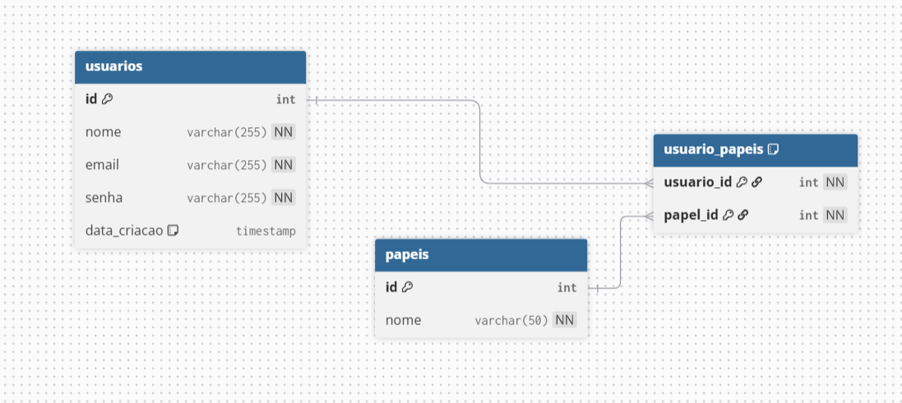

# API de Gerenciamento de Usuários - Teste Rhally

Esta é a API back-end para o teste de Desenvolvedor Full Stack da Rhally. A API é responsável pelo gerenciamento de usuários (CRUD) e autenticação via JWT.

## 🛠️ Tecnologias Utilizadas

* Node.js
* Express.js
* MySQL
* JSON Web Token (JWT)
* Supabase

---

## 🗄️ Banco de Dados (MySQL)

Esta seção detalha a estrutura e a modelagem do banco de dados utilizado pela API.

### Modelagem e Normalização

Para a implementação prática da aplicação, foi criada a tabela `usuarios`, que atende a todos os requisitos do CRUD. 

No entanto, para responder à questão do teste sobre escalabilidade e a adição de papéis de usuário (roles), foi projetado o Diagrama Entidade-Relacionamento (DER) a seguir. Ele demonstra a abordagem normalizada, utilizando uma tabela de junção para criar uma relação Muitos-para-Muitos, o que representa a melhor prática para este cenário.

**Diagrama Entidade-Relacionamento (DER):**

 

### Script de Implementação

O script SQL para a criação da tabela `usuarios`, efetivamente utilizada na aplicação, está localizado no arquivo:
`/database/schema.sql`

### Query Solicitada no Teste

**- Escreva uma query para listar os 5 usuários mais recentes cadastrados.**
```sql
SELECT * FROM usuarios ORDER BY data_criacao DESC LIMIT 5;
```


### Alteração do Banco de Dados e Justificativa

No teste técnico, foi solicitada a utilização do MySQL para a modelagem e implementação do banco de dados, o que foi realizado. Criei a tabela de usuários e a configurei com as colunas id, nome, email, senha e data_criacao.

No entanto, durante a fase de desenvolvimento, encontrei um problema de conexão persistente entre a minha aplicação local e o banco de dados hospedado na nuvem no Railway. O erro ETIMEDOUT (Tempo Esgotado) foi a principal barreira, impedindo a comunicação entre o meu código e o servidor de banco de dados, mesmo após revisar as variáveis de ambiente e tentar diferentes configurações.

Para garantir a entrega do projeto dentro do prazo e focar na implementação das funcionalidades de API (CRUD), optei por utilizar o Supabase. Essa plataforma, que utiliza PostgreSQL, é uma alternativa robusta e me permite continuar o desenvolvimento do back-end sem comprometer a integridade e a arquitetura do projeto.

O Supabase simplifica a criação e a conexão com o banco de dados, permitindo que eu me concentre na lógica de negócio e na construção das APIs REST, conforme solicitado no teste.